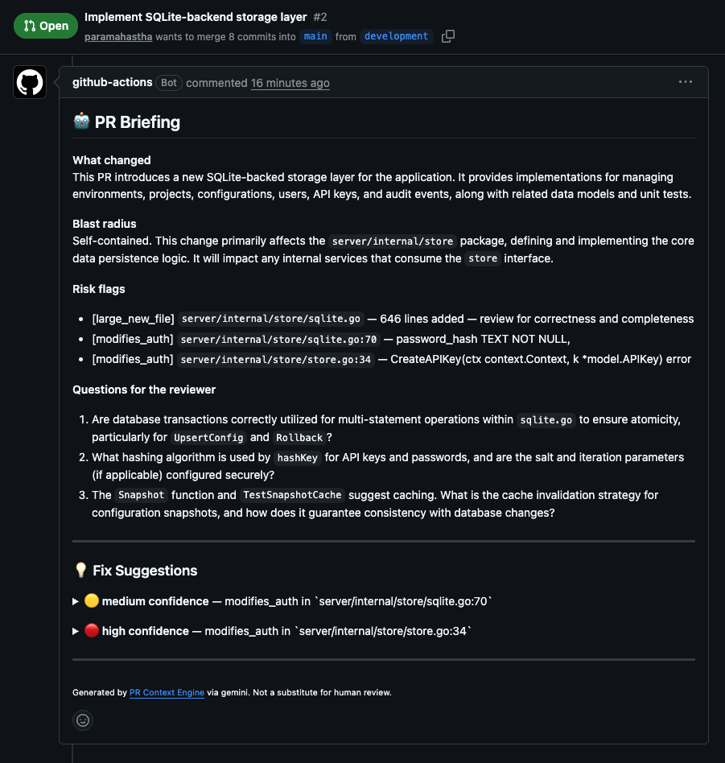

# PR Context Engine

[](https://github.com/paramahastha/pr-context-engine/actions/workflows/pr-review.yml)
[](https://pypi.org/project/pr-context-engine/)
[](LICENSE)
[](https://www.python.org/downloads/)

> An AI tool that reads every PR and writes the briefing — and the fixes — a senior engineer would, with the calibration data to prove it's not just guessing.



## What it does

Every PR opens with three problems for the reviewer: _what is this actually doing_, _what could it break_, and _what should I push back on_. A diff doesn't answer any of those.

PR Context Engine reads the diff plus surrounding code, recent git history, and semantically similar code from elsewhere in the repo, then posts a terse briefing written like a senior backend engineer would write it. No praise. No filler. No "this LGTM." Just the context a reviewer needs.

With `ENABLE_FIXES=true`, it also generates confidence-gated patch suggestions for located issues — posted as collapsible GitHub suggestion blocks the maintainer can apply in one click. When it isn't sure, it says so in prose instead of guessing.

## Quickstart (5 minutes)

### Check your setup first

```bash
pipx install pr-context-engine
export GROQ_API_KEY=<your-key>       # free at console.groq.com/keys
export GITHUB_TOKEN=$(gh auth token)
pr-context-engine quickstart         # checks keys, scopes, prints what's missing
```

### Option A — GitHub Action (recommended)

1. Pick a provider and get an API key (see table below).
2. Add it as a secret: **Settings → Secrets → Actions → New secret**.
3. Enable write permissions: **Settings → Actions → General → Workflow permissions → Read and write**.
4. Add this to `.github/workflows/pr-briefing.yml`:

```yaml
name: PR Briefing
on:
  pull_request:
    types: [opened, synchronize, reopened]
jobs:
  brief:
    runs-on: ubuntu-latest
    permissions:
      pull-requests: write
      contents: read
    steps:
      - uses: paramahastha/pr-context-engine@main
        with:
          groq-api-key: ${{ secrets.GROQ_API_KEY }}   # default provider
```

That's it. Every new PR gets a briefing comment automatically.

> **Using a different provider?** Set `llm-provider` to match your key — see [Switching LLM providers](#switching-llm-providers) below.

### Option B — CLI (any CI or local)

```bash
pipx install pr-context-engine
export GROQ_API_KEY=<your-groq-key>
export GITHUB_TOKEN=$(gh auth token)

# Dry-run: see the briefing without posting it
pr-context-engine review --pr 42 --repo owner/name --dry-run

# Post the real comment
pr-context-engine review --pr 42 --repo owner/name
```

## Live example

A PR touching auth middleware produces this comment automatically:

```markdown
## 🤖 PR Briefing

**What changed**
Refactors session token storage from an in-memory dict to Redis, adding a configurable
TTL. The auth middleware is updated to hit Redis on every request.

**Blast radius**
Any caller of `get_session()` now depends on Redis being reachable. If Redis is down,
all authenticated requests will 401. The previous in-memory store had no such single
point of failure.

**Risk flags**
- `modifies_auth`: src/auth/session.py line 42 — `token = generate_token(user_id)`

**Questions for the reviewer**

1. The Redis client is initialised once at import time — is there a reconnect strategy
   if the connection drops mid-deploy?
2. `SESSION_TTL` defaults to 3600 but the old in-memory store had no TTL — will existing
   sessions all expire immediately after deploy?
3. There are no tests for the Redis-down path — is 401-on-outage the intended degradation,
   or should it fall back to the old store?

---

<sub>Generated by [PR Context Engine](https://github.com/paramahastha/pr-context-engine) via groq. Not a substitute for human review.</sub>
```

## Architecture

```
Front door A:                         Front door B:
GitHub Action wrapper                 pipx install + run in any CI / locally
(paramahastha/pr-context-engine@main) (pr-context-engine review --pr 42 --repo …)
      │                                      │
      └──────────────┬───────────────────────┘
                     ▼
      ┌──────────────────────────────────────┐
      │   CLI core — src/cli.py              │
      │   orchestrate: diff → analyze →      │
      │   brief → (fixes) → post             │
      └──────────────────────────────────────┘
                     │
      ├──► analyzers/    diff → FileChange objects, AST symbols, risk flags
      ├──► context/      git history + sqlite-vec RAG (fastembed, local)
      ├──► briefing/     prompt assembly → LLM call → structured Briefing
      ├──► fixes/        confidence-gated patch suggestions (opt-in)
      ├──► llm/          FailoverProvider: Groq → Gemini → hard error
      └──► github_api/   fetch diff, post comment + suggestion blocks
```

The CLI is the product; the GitHub Action is a thin wrapper. All logic lives in Python — no YAML logic.

See [docs/architecture.md](docs/architecture.md) for the full Mermaid diagram and data-flow walkthrough.

## Switching LLM providers

| Provider | Secret name | `llm-provider` value | Notes |
|---|---|---|---|
| `groq` *(default)* | `GROQ_API_KEY` | `groq` | Free, ~1 000 req/day, fast |
| `gemini` | `GEMINI_API_KEY` | `gemini` | Free-tier, ~1 500 req/day |
| `anthropic` | `ANTHROPIC_API_KEY` | `anthropic` | BYO key, no free tier |
| `ollama` | — | `ollama` | Local, offline, no rate limits |

**You must set both `llm-provider` and the matching API key input.** Providing only the key without `llm-provider` will fail because the default provider is `groq`.

**GitHub Action examples:**

```yaml
# Gemini
- uses: paramahastha/pr-context-engine@main
  with:
    llm-provider: gemini
    gemini-api-key: ${{ secrets.GEMINI_API_KEY }}

# Anthropic
- uses: paramahastha/pr-context-engine@main
  with:
    llm-provider: anthropic
    anthropic-api-key: ${{ secrets.ANTHROPIC_API_KEY }}

# Ollama (self-hosted)
- uses: paramahastha/pr-context-engine@main
  with:
    llm-provider: ollama
    ollama-base-url: http://my-ollama-host:11434
```

**CLI / env var:**

```bash
LLM_PROVIDER=gemini GEMINI_API_KEY=<key> pr-context-engine review --pr 42 --repo owner/name
```

**Automatic failover:** if `GEMINI_API_KEY` is set alongside any other provider, Gemini is used as a fallback on rate-limit errors. The PR comment footer shows which provider was actually used. See [ADR-7](docs/design-decisions.md#adr-7-provider-failover-order-and-motivation).

## Fix suggestions (opt-in)

When `ENABLE_FIXES=true`, the tool generates confidence-gated patch suggestions for located issues (flags with a known file + line). Only `high`/`medium` confidence suggestions become one-click GitHub suggestion blocks; `low` confidence produces prose notes only. Max 3 suggestions per PR.

```yaml
- uses: paramahastha/pr-context-engine@main
  with:
    groq-api-key: ${{ secrets.GROQ_API_KEY }}
    enable-fixes: "true"
```

See [ADR-5](docs/design-decisions.md#adr-5-opt-in-fix-suggestions-with-confidence-gating-milestone-8) for why this is opt-in and confidence-gated.

## Eval results

`pytest tests/eval/` measures briefing quality across 15 real-world PR fixtures.

**Static analysis (no API key needed):**

| Metric | Score |
|---|---|
| Risk flag precision | **1.00** (0 false positives across 15 fixtures) |
| Risk flag recall | **1.00** (all expected flags detected) |

**LLM-as-judge scores** (run with `GROQ_API_KEY` + `ANTHROPIC_API_KEY`) assess five dimensions — Accuracy, Blast radius, Risk flags, Question quality, Brevity — on a 0–3 scale, plus Fix correctness and Calibration rate for the fix feature. Historical scores are committed to `tests/eval/scores.jsonl` so regressions are visible in git history.

```bash
# Analyzer-only (no API key needed):
pytest tests/eval/ -v

# Full eval with LLM-as-judge scoring:
GROQ_API_KEY=... ANTHROPIC_API_KEY=... pytest tests/eval/ -v -s
```

The headline metrics are **fix correctness rate** (when the bot proposed a patch, was it actually correct?) and **false-confidence rate** (when it said `high` confidence, how often was the patch wrong?). These are the hardest-to-fake numbers in the scorecard.

## Data & privacy

**What leaves your machine:**

- The PR diff and parsed metadata (file paths, function names, changed lines) are sent to the active LLM provider (Groq or Gemini by default).
- No source code beyond the diff is sent to any external API. The codebase index (RAG) runs entirely locally via `fastembed` + `sqlite-vec` — no embedding API, no external call.
- Git history and PR metadata are fetched from the GitHub API using your `GITHUB_TOKEN`.

**Provider data policies:**

- Groq and Gemini free tiers may use inputs for model improvement. Check their privacy policies before using on private or sensitive repos.
- Use `LLM_PROVIDER=ollama` or `LLM_PROVIDER=anthropic` (BYO key) if you need stronger data-isolation guarantees.
- The tool has no shared backend. Your API key, your quota, your data. Running it on 1 000 repos costs you nothing extra and costs me nothing.

## Design decisions

Short ADRs covering the tradeoffs that shaped the architecture:

| ADR | Decision |
|---|---|
| [ADR-0](docs/design-decisions.md#adr-0-provider-abstraction-built-early) | Provider abstraction built in M2, not retrofitted later |
| [ADR-1](docs/design-decisions.md#adr-1-cli-core-with-two-front-doors) | CLI-core with two front doors (Action + pipx) |
| [ADR-2](docs/design-decisions.md#adr-2-sqlite--sqlite-vec-over-a-hosted-vector-store) | SQLite + sqlite-vec over Pinecone or Chroma |
| [ADR-3](docs/design-decisions.md#adr-3-local-embeddings-via-fastembed) | Local embeddings via fastembed (no embedding API) |
| [ADR-4](docs/design-decisions.md#adr-4-shallow-clone-tradeoff-in-ci-fetch-depth-50) | fetch-depth: 50 tradeoff in CI |
| [ADR-5](docs/design-decisions.md#adr-5-opt-in-fix-suggestions-with-confidence-gating-milestone-8) | Fix suggestions opt-in and confidence-gated |
| [ADR-6](docs/design-decisions.md#adr-6-mit-license) | MIT license |
| [ADR-7](docs/design-decisions.md#adr-7-provider-failover-order-and-motivation) | Failover order: Groq → Gemini → hard error |
| [ADR-8](docs/design-decisions.md#adr-8-python-312-as-the-implementation-language) | Python 3.12 over Go/TypeScript/Rust |

## Cost

**$0/month** for a portfolio-scale project on public repos.

| Component | Cost |
|---|---|
| GitHub Actions | Free for public repos |
| Groq (default LLM) | Free tier, ~1 000 req/day |
| Gemini (failover) | Free tier, ~1 500 req/day |
| Local embeddings (`fastembed`) | $0, no API, runs in-process |
| Shared backend | None — your key, your quota |

Free LLM tiers change without warning (Gemini cut 50–80% in Dec 2025). The [failover design](docs/design-decisions.md#adr-7-provider-failover-order-and-motivation) means a single provider's policy change degrades gracefully instead of breaking the tool.

## Configuration

See [CONFIG.md](CONFIG.md) for every env var, flag, default, and a minimal vs. full example.

## Contributing

See [CONTRIBUTING.md](CONTRIBUTING.md) for dev setup, running tests, and the milestone philosophy. Bug reports and feature requests go in [Issues](https://github.com/paramahastha/pr-context-engine/issues).
