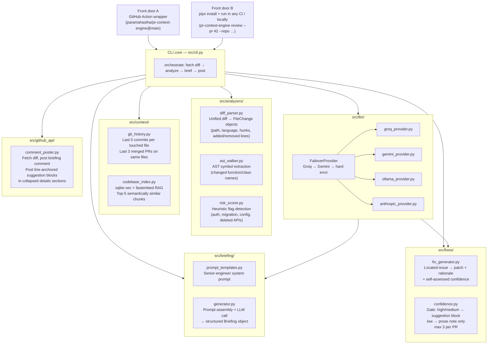

# Architecture

## Overview

PR Context Engine follows a **CLI-core with two front doors** design. The CLI (`src/cli.py`) is the product; the GitHub Action is a thin wrapper around it. No orchestration logic lives in YAML.

This means the tool is:
- Testable locally (`pr-context-engine review --pr 42 --repo owner/name --dry-run`)
- Runnable in any CI (GitLab, CircleCI, Jenkins) with no GitHub lock-in
- Installable as a standalone CLI (`pipx install pr-context-engine`)
- The GitHub Action just calls the same binary any user would call

## System diagram



## Data flow for a single PR

```
1. CLI receives --pr N --repo owner/name
2. github_api fetches the unified diff via REST
3. diff_parser converts raw diff → list[FileChange]
4. ast_walker extracts changed symbol names per file
5. risk_scorer emits located-issue objects {flag, file, line, snippet}
6. git_history fetches last 5 commits per touched file + last 3 merged PRs
7. codebase_index queries sqlite-vec for top-5 related chunks per FileChange
8. briefing/generator assembles all context into a structured prompt
9. llm/FailoverProvider calls Groq (falls back to Gemini on 429)
10. Generator parses the LLM response into a Briefing object
11. If ENABLE_FIXES=true: fix_generator generates patches for located issues
    confidence.py gates: high/medium → suggestion block, low → prose
12. github_api posts the comment (briefing + collapsed suggestion blocks)
```

## Module responsibilities

| Module | Single responsibility |
|---|---|
| `src/cli.py` | Typer entrypoint; orchestrates the pipeline; no business logic |
| `src/config.py` | Reads env vars, instantiates the right LLM provider |
| `src/analyzers/diff_parser.py` | Unified diff → `FileChange` data objects |
| `src/analyzers/ast_walker.py` | AST symbol extraction for Python/JS/TS/Go |
| `src/analyzers/risk_scorer.py` | Heuristic flags → located-issue objects |
| `src/context/git_history.py` | Commit history and merged-PR context per file |
| `src/context/codebase_index.py` | sqlite-vec RAG index; embedding via fastembed |
| `src/briefing/prompt_templates.py` | System prompt text (verbatim; no logic) |
| `src/briefing/generator.py` | Prompt assembly + LLM call + response parsing |
| `src/fixes/fix_generator.py` | Located issue → structured patch + confidence |
| `src/fixes/confidence.py` | Gate logic: which confidence levels produce suggestion blocks |
| `src/llm/base.py` | `LLMProvider` abstract interface |
| `src/llm/groq_provider.py` | Groq implementation |
| `src/llm/gemini_provider.py` | Gemini implementation |
| `src/llm/ollama_provider.py` | Local Ollama implementation |
| `src/llm/anthropic_provider.py` | Anthropic implementation |
| `src/llm/__init__.py` | `FailoverProvider` wrapping ordered provider list |
| `src/github_api/comment_poster.py` | Diff fetch + PR comment posting + suggestion blocks |

## Key design decisions

The five decisions that shaped everything else — with the reasoning that would survive a six-month gap:

1. **CLI-core over Action-only** — makes the tool testable locally and portable across CI systems. See [ADR-1](design-decisions.md#adr-1-cli-core-with-two-front-doors).

2. **Provider abstraction built in M2, not last** — free LLM tiers change without warning (Gemini cut 50–80% in Dec 2025). Retrofitting abstraction later would have required touching every caller. See [ADR-0](design-decisions.md#adr-0-provider-abstraction-built-early).

3. **sqlite-vec + fastembed over a hosted vector store** — $0/month, no external service, no second API key, no latency for network round-trips. The index file is cached across Action runs. See [ADR-2](design-decisions.md#adr-2-sqlite--sqlite-vec-over-a-hosted-vector-store) and [ADR-3](design-decisions.md#adr-3-local-embeddings-via-fastembed).

4. **Located-issue data shape in M3** — `risk_scorer` emits `{flag, file, line, snippet}` objects from the start. M8's fix generator depends on `file` and `line`; a bare string list would have forced a painful refactor eight milestones later.

5. **Fix suggestions opt-in and confidence-gated** — a confidently-wrong auto-fix erodes trust faster than no fix. The calibration metric in the eval harness is the accountability mechanism. See [ADR-5](design-decisions.md#adr-5-opt-in-fix-suggestions-with-confidence-gating-milestone-8).
